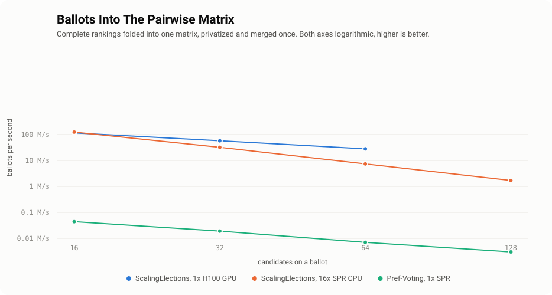
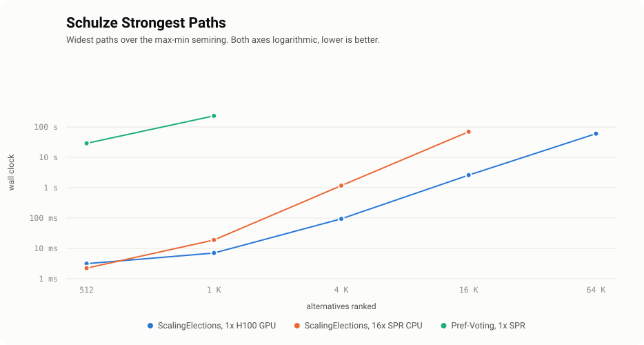
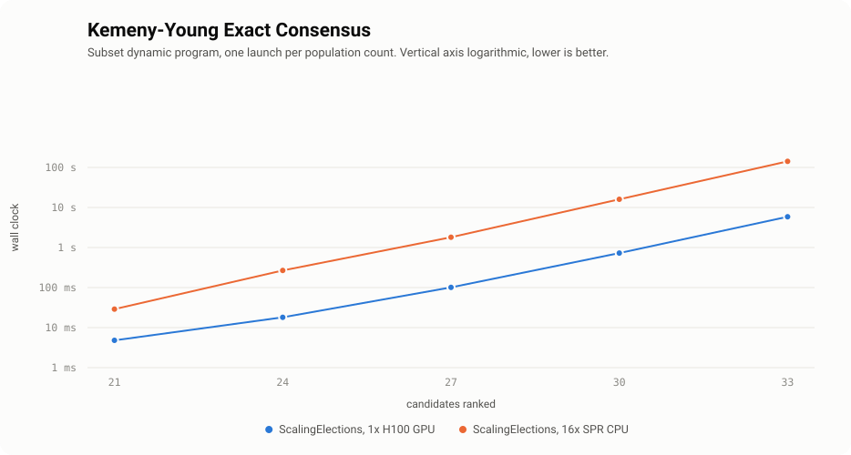

# Scaling Elections with GPUs and Mojo 🔥


This repository implements tiled parallel adaptations of the [Schulze method](https://en.wikipedia.org/wiki/Schulze_method), [Split Cycle](https://arxiv.org/abs/2004.02350), and [Kemeny-Young](https://en.wikipedia.org/wiki/Kemeny%E2%80%93Young_method), accelerated across CPUs and GPUs in Mojo and CUDA C++ and wrapped into Python.
Schulze elects the leaders of Debian, the Wikimedia Foundation and several Pirate Parties, and it is a good example of a combinatorial problem that [parallelizes by changing evaluation order](https://ashvardanian.com/posts/scaling-elections).

All three read the electorate only through the $N \times N$ matrix of pairwise counts, and nothing else about the ballots survives that summary.
Social choice theory calls such rules __C2__, after [Fishburn's 1977 classification](https://doi.org/10.1137/0133030) of [Condorcet methods](https://en.wikipedia.org/wiki/Condorcet_method): C1 sees only who beats whom, C2 sees the margins too, and C3 needs more than a matrix can hold.
So one tiled max-min kernel serves Schulze on winning votes and Split Cycle on margins, and Kemeny's runtime is flat in the electorate — ten thousand ranked ballots and ten million cost the same once counted.

The answers differ even though the input does not: Schulze names a ranking, Kemeny a strict ordering with the disagreement it costs, and Split Cycle a set of undefeated candidates.
The boundary is the [single transferable vote](https://en.wikipedia.org/wiki/Single_transferable_vote) family, which eliminates candidates and re-transfers their ballots to the next surviving preference — something no pairwise summary can reconstruct.

## Usage

There is no package-registry release; the repository is the distribution.
The extension compiles during the install, against CUDA where `nvcc` is present and against the host compiler otherwise, and the Numba kernels come with it either way.
No CMake is involved: the whole native build lives in `setup.py`, following [this template](https://github.com/ashvardanian/cuda-python-starter-kit).

```sh
uv pip install git+https://github.com/ashvardanian/ScalingElections.git
```

Ballots go in, one $N \times N$ matrix comes out, and every method reads that matrix:

```py
from scalingelections import (
    build_pairwise_preferences,
    compute_strongest_paths,
    compute_split_cycle_winners,
    compute_kemeny_ranking,
)

preferences = build_pairwise_preferences(ballots)            # ballots → N×N counts
strengths = compute_strongest_paths(preferences)             # Schulze widest paths
undefeated = compute_split_cycle_winners(preferences)        # Split Cycle winning set
ranking, disagreement = compute_kemeny_ranking(preferences)  # exact Kemeny-Young
```

Every entry point takes a `backend=` naming where the work runs, and raises rather than quietly falling back when a device or a build cannot serve it:

```py
compute_strongest_paths(preferences, backend="gpu_hopper")   # needs sm_90 or newer
compute_kemeny_ranking(preferences, backend="gpu_layered")   # one launch per popcount layer
```

An electorate need not sit in memory at once, so the tally takes blocks and sums one matrix over them:

```py
from scalingelections import tally_chunks

preferences = tally_chunks(read_ballots_in_blocks(), num_candidates=20)
```

The Mojo kernels build and validate through [pixi](https://pixi.sh):

```sh
pixi run test     # cross-checks all three languages against each other
pixi run bench    # the headline problem size
```

## What's Inside

Ballots fold into one pairwise matrix, and every method reads that and nothing else.
The work splits in two, and the halves scale in opposite directions.
__Counting ballots is bounded by voters and indifferent to the field.__
__Ranking the field is bounded by candidates and indifferent to the electorate.__

Numbers come from an idle machine, with vote counts drawn at national scale so the packed 16-bit sweep stays out of them.
`assets/charts.py` redraws a chart from numbers passed on its command line, so these tables stay the only place they live.

### Ballots

Ranked ballots fold into the $N \times N$ matrix every method reads, and this is the only path a real electorate stresses.
Each ballot contributes $N \times (N - 1) / 2$ increments, [privatized](https://github.com/ashvardanian/ParallelReductionsBenchmark) per host thread or per device block and merged once.
An electorate arrives in chunks rather than whole, so only the chunk in hand is ever resident.

<picture>
  <source media="(prefers-color-scheme: dark)" srcset="assets/ballots-dark.svg">
  
</picture>

| Variant                       | 16 candidates | 32 candidates | 64 candidates | 128 candidates |
| :---------------------------- | ------------: | ------------: | ------------: | -------------: |
| ScalingElections, 1x H100 GPU |     115.3 M/s |      57.4 M/s |      28.1 M/s |              — |
| ScalingElections, 16x SPR CPU |     124.0 M/s |      32.1 M/s |       7.4 M/s |        1.7 M/s |
| Pref-Voting, 1x SPR           |     0.044 M/s |     0.019 M/s |     0.007 M/s |      0.003 M/s |
|                               |               |               |               |                |
| 350M Ballots                  |         2.8 s |         6.1 s |        12.5 s |        201.1 s |

> Measured 24 August 2026.


### Schulze

Widest paths over the max-min semiring, [tiled](https://moorejs.github.io/APSP-in-parallel/) into a diagonal phase, two partially-dependent phases, and an independent phase carrying the cubic bulk.
Split Cycle rides the same kernel over margins rather than winning votes, which is what sharing one summary buys.
The field can be enormous, and voters cost nothing.

<picture>
  <source media="(prefers-color-scheme: dark)" srcset="assets/schulze-dark.svg">
  
</picture>

| Variant                       |   512 candidates |    1K candidates |   4K candidates |    16K candidates |    64K candidates |
| :---------------------------- | ---------------: | ---------------: | --------------: | ----------------: | ----------------: |
| ScalingElections, 1x H100 GPU |  3.2 ms · 43 GCs | 7.0 ms · 152 GCs | 94 ms · 729 GCs | 2.59 s · 1.70 TCs | 60.3 s · 4.66 TCs |
| ScalingElections, 16x SPR CPU |  2.2 ms · 60 GCs |   19 ms · 57 GCs | 1.17 s · 59 GCs |   69.8 s · 63 GCs |                 — |
| Pref-Voting, 1x SPR           | 29.0 s · 4.6 MCs |    232 s · 5 MCs |               — |                 — |                 — |
|                               |                  |                  |                 |                   |                   |
| Memory Usage                  |           1.0 MB |           4.2 MB |         67.1 MB |           1.07 GB |           17.2 GB |

> Measured 24 August 2026.

__Note that, production Schulze is tiny.__
Debian, Wikimedia and the Pirate Parties run it over fewer than ten candidates, where the sweep is microseconds and the tally is everything.
A field of thousands is a different problem wearing the same mathematics — __aggregating rankings rather than electing anyone__ — fusing search results, ordering a catalogue, ranking a pool of rated players.

### Kemeny-Young

The ordering that contradicts fewest ballots, found exactly rather than approximated, because minimising pairwise disagreement is NP-hard.
The subset dynamic program costs $2^N$ entries and $O(N \cdot 2^N)$ relaxations, one kernel launch per population count with a thread to each subset.
Voters are free: the summary is the same size whether ten thousand or a billion people voted.

<picture>
  <source media="(prefers-color-scheme: dark)" srcset="assets/kemeny-dark.svg">
  
</picture>

| Variant                       | 21 candidates | 24 candidates | 27 candidates | 30 candidates | 33 candidates |
| :---------------------------- | ------------: | ------------: | ------------: | ------------: | ------------: |
| ScalingElections, 1x H100 GPU |          5 ms |         18 ms |        101 ms |        727 ms |        5.86 s |
| ScalingElections, 16x SPR CPU |         29 ms |        268 ms |        1.80 s |        16.0 s |       2.4 min |
|                               |               |               |               |               |               |
| Memory Usage                  |       16.8 MB |        134 MB |       1.07 GB |       8.59 GB |       68.7 GB |

> Measured 24 August 2026, both processors returning the same ranking and the same score at every width.

__Real contests fit.__
The 2020 Democratic primary drew 29 candidates, and the Associated Press college football poll ranks 25 teams from about 60 ballots.
Such a poll is estimating a true order from noisy judgements, and [Young showed in 1988](https://doi.org/10.2307/1961757) that Kemeny returns exactly the maximum-likelihood answer to that question.
__A larger field is not slow, it is impossible.__

__And the subset program is not the fastest way to reach the field it can.__
Kemeny's optimum is a minimum-weight feedback arc set, and an integer program over the triangle inequalities solves that directly.
[Pref-Voting](https://pypi.org/project/pref-voting/) reaches the same optimum a third way, by walking all $N!$ orderings, which is where its column ends:

| Variant                       | 10 candidates | 21 candidates | 27 candidates | 33 candidates |
| :---------------------------- | ------------: | ------------: | ------------: | ------------: |
| ScalingElections, 1x H100 GPU |        0.6 ms |          5 ms |        101 ms |        5.86 s |
| iGraph `ip_ti`, 1x SPR core   |        0.8 ms |         39 ms |        177 ms |        323 ms |
| Pref-Voting, 1x SPR           |        22.6 s |             — |             — |             — |

> Measured 24 August 2026. All three agree on the score wherever more than one of them finishes.

[Betzler, Bredereck and Niedermeier](https://doi.org/10.1007/s10458-013-9236-y) put the crossover near 23 candidates and report a 69-candidate instance solved exactly in under four seconds, which the table above corroborates.
What the subset program buys is not speed but a cost that does not depend on the profile: an integer program is fast when the electorate broadly agrees and collapses when it does not, while `2^N` states cost the same either way.
Take it as a worst-case guarantee and a memory-hierarchy result, not as the practical frontier.

## Paradoxes

Every method here is Condorcet-consistent: hand it a candidate who beats every other head to head, and that candidate wins.
Plurality, Borda and instant-runoff all fail that, which is the usual reason to reach past them.
The interesting question is what each rule still admits once you have it.

| Criterion                 | Schulze | Split Cycle | Kemeny | Plurality | Borda |  IRV  |
| :------------------------ | :-----: | :---------: | :----: | :-------: | :---: | :---: |
| Elects a Condorcet winner |  __✓__  |    __✓__    | __✓__  |     ✗     |   ✗   |   ✗   |
| Monotonic                 |  __✓__  |    __✓__    | __✓__  |   __✓__   | __✓__ |   ✗   |
| Independent of clones     |  __✓__  |    __✓__    |   ✗    |     ✗     |   ✗   | __✓__ |
| Positive involvement      |    ✗    |    __✓__    |   ✗    |   __✓__   | __✓__ |   ✗   |

> IRV is the single-winner case of the single transferable vote.

__No column is all ticks, and none can be.__
[Moulin proved in 1988](https://doi.org/10.1016/0022-0531(88)90253-0) that every Condorcet-consistent rule admits the no-show paradox once there are four candidates and twenty-five voters, so the price of the first row is paid somewhere below it.
Split Cycle escapes the _positive_ half of that — a ballot ranking someone first never demotes them — but not the full participation criterion Moulin rules out.

### A Ballot That Hurts Its Own Favourite

Eleven voters ranking Python, Rust, Go and Java are enough to show Schulze failing positive involvement.
Ten of them elect Java, and adding one more ballot that puts Java _first_ elects Python instead.
Split Cycle, closing the same kernel over margins rather than winning votes, keeps Java either way.

| Electorate                         | Schulze | Split Cycle      |
| :--------------------------------- | :------ | :--------------- |
| 10 voters                          | Java    | Python, Go, Java |
| Plus one ballot ranking Java first | Python  | Python, Java     |

### Three Rules, One Electorate, Three Answers

These are not variations on a theme, and nine voters are enough to separate them.

```
Rust > Python > Go > Java        Python beats Go
Rust > Python > Java > Go        Rust beats Python and Java
Java > Python > Go > Rust        Go beats Rust and Java
Go > Rust > Java > Python        Java beats Python
Rust > Python > Go > Java
Go > Java > Rust > Python
Java > Python > Go > Rust
Go > Rust > Java > Python
Java > Python > Go > Rust
```

Nobody beats everybody, so the majority relation cycles and each rule breaks it its own way.

| Rule        | Answer                    | Why                                                          |
| :---------- | :------------------------ | :----------------------------------------------------------- |
| Schulze     | Java                      | Its widest path to everyone is 6, and every path back is 5   |
| Split Cycle | Rust, Go, Java            | Cutting the cycle's weakest link leaves three undefeated     |
| Kemeny      | Go > Rust > Java > Python | Contradicts 23 ballots where the next-best ordering costs 24 |

Schulze names one candidate, Split Cycle names three, and Kemeny puts a candidate first that Schulze rejects outright.
Both singletons are decisive rather than tie-broken, and `test.py` asserts every cell above.

## Citation

If ScalingElections helps your research or product, please cite it:

```bibtex
@software{Vardanian_ScalingElections,
  author = {Vardanian, Ash},
  title = {{ScalingElections: Condorcet Voting at GPU Speed — Schulze as semiring matrix multiplication, Kemeny-Young as exact NP-hard search}},
  doi = {10.5281/zenodo.22073377},
  url = {https://github.com/ashvardanian/ScalingElections},
  license = {Apache-2.0}
}
```

That is the concept DOI, so it resolves to whichever release is newest.
[`CITATION.cff`](CITATION.cff) carries it alongside the DOI minted for the specific version, for when a paper needs to name the exact code it ran.
